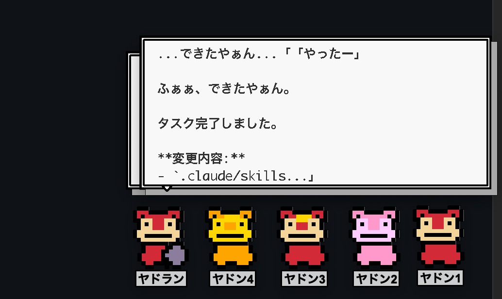

# yadon-agents



デスクトップにヤドンたちが住み着いて、コーディングを手伝ってくれるマルチエージェントシステム。

ヤドキング（opus）に話しかけると、ヤドラン（sonnet）がタスクを分解し、ヤドンたち（haiku）が並列で実作業を行う。PyQt6環境ではドット絵のデスクトップペットが表示され、作業状況を吹き出しで教えてくれる。

```
トレーナー（人間）
  │ 直接会話
  ▼
┌──────────────────┐
│   ヤドキング       │  claude --model opus（対話型）
└──────┬───────────┘
       │ Unix socket
       ▼
┌──────────────────┐
│   ヤドラン        │  claude -p (sonnet) でタスク分解 → ヤドンに配分
└──┬───┬───┬───┬──┘
   ▼   ▼   ▼   ▼
┌──┐ ┌──┐ ┌──┐ ┌──┐
│Y1│ │Y2│ │..│ │YN│  claude -p (haiku) で並列実行
└──┘ └──┘ └──┘ └──┘
```

| ポケモン | モデル | 役割 |
|----------|--------|------|
| ヤドキング | opus | 戦略統括、最終レビュー、人間との対話 |
| ヤドラン | sonnet | タスクを3フェーズに分解、ヤドンへの並列配分 |
| ヤドン×N | haiku | 実作業（コーディング、テスト、ドキュメント、レビュー） |

## セットアップ

### 1. Claude Code をインストール

[Claude Code](https://docs.anthropic.com/en/docs/claude-code) の手順に従い、`claude` CLI をインストール・認証する。

```bash
claude  # 初回起動で認証
```

### 2. uv をインストール

```bash
curl -LsSf https://astral.sh/uv/install.sh | sh
```

### 3. リポジトリをクローン

```bash
git clone https://github.com/ida29/yadon-agents.git
cd yadon-agents
```

### 4. 依存関係をインストール

```bash
uv sync
```

PyQt6も自動的にインストールされ、デスクトップペットが使えるようになります。

### 5. グローバルコマンドとしてインストール（オプション）

システム全体で`yadon`コマンドを使いたい場合:

```bash
uv tool install git+https://github.com/ida29/yadon-agents
```

## クイックスタート

インストール不要で即座に起動:

```bash
# インストール不要で即起動
uvx --from git+https://github.com/ida29/yadon-agents yadon start --multi-llm
```

詳細は「起動」セクションを参照。

## 起動

### uvx で起動（推奨）

インストール不要で即実行:

```bash
# 通常起動（全員Claude）
uvx --from git+https://github.com/ida29/yadon-agents yadon start

# マルチLLMモード（各ワーカーに異なるLLMを割り当て）
uvx --from git+https://github.com/ida29/yadon-agents yadon start --multi-llm

# 作業ディレクトリ指定
uvx --from git+https://github.com/ida29/yadon-agents yadon start /path/to/project --multi-llm

# ヤドン数を指定して起動（デフォルト4、範囲1-8）
YADON_COUNT=6 uvx --from git+https://github.com/ida29/yadon-agents yadon start --multi-llm
```

### 開発時（リポジトリクローン後）

```bash
# リポジトリをクローン
git clone https://github.com/ida29/yadon-agents.git
cd yadon-agents

# 依存をインストール
uv sync

# uv run で起動
uv run yadon start --multi-llm

# ヤドン数を変更
YADON_COUNT=6 uv run yadon start --multi-llm
```

### グローバルインストール

頻繁に使う場合は uv tool install でグローバルインストール:

```bash
# 一度だけ実行
uv tool install git+https://github.com/ida29/yadon-agents

# 以降はどこからでも
yadon start --multi-llm
YADON_COUNT=6 yadon start --multi-llm
```

### 停止 / 再起動 / その他コマンド

```bash
# 停止
yadon stop

# ステータス確認
yadon status

# 再起動
yadon restart --multi-llm

# ペットに吹き出しメッセージを送信
yadon say 1 "やるきスイッチ！"
yadon say 2 "頑張ります" --type normal --duration 3000
yadon say 3 "メッセージ"
```

詳細な CLI コマンド仕様は CLAUDE.md の「CLIコマンド」セクションを参照。

ヤドキングのプロンプトが表示されたら、自然言語でタスクを依頼するだけ。ヤドキング終了時にデーモン+ペットも自動停止する。

## 仕組み

1. 人間がヤドキングに依頼（例: 「認証機能を追加して」）
2. ヤドキングがヤドランにタスクを送信
3. ヤドランがタスクを3フェーズに分解（implement → docs → review）
4. 各フェーズ内のサブタスクをヤドンたちが並列実行
5. 結果がヤドラン → ヤドキングへ返却され、人間に報告

## テスト

```bash
python -m pytest tests/ -v
```

## セキュリティ上の注意

- **Unixソケット（`/tmp/`）の脆弱性**: タスク指示にAPIキーやトークンを含めないこと。システム上の他ユーザーがソケット経由でメッセージを傍受可能。本番デプロイでは `/tmp` を秘密ディレクトリに変更を推奨
- **Claude出力の信頼性**: タスク分解やコード生成結果は自動実行される。必ずヤドキング（あなた）が最終レビューを行うこと
- **外部コマンド実行**: ヤドンたちは任意のBashコマンドを実行可能。信頼できるプロジェクトのみで使用すること

詳細は CLAUDE.md の「注意事項」セクションを参照。

## ドキュメントと設定

### 設計規約（`.claude/rules/`）

プロジェクト固有の設計判断と実装ガイドラインを含むドキュメント：

| ファイル | 内容 |
|---------|------|
| `python.md` | Python設計規約：CLIモジュール化、Port & Adapter、BaseAgent + on_bubble、テスト注意点、uv依存管理、PID管理削除 |
| `security.md` | セキュリティガイドライン：ソケット通信、JSONパース、エラーハンドリング、リソース管理、リーク防止 |
| `testing.md` | テスト仕様：Pytestベストプラクティス、モック定義、キャッシュリセット、カバレッジ目標 |

### スキル（`.claude/skills/`）

Claude Code 統合スキル（サブエージェント支援ツール）：

| スキル | 内容 |
|-------|------|
| `commit` | diff分析 → 論理的に分割コミット。conventional commitメッセージを自動生成 |
| `theme-system` | テーマ層の編集時やスプライト・メッセージカスタマイズ時に使用 |

### メインドキュメント

詳細なアーキテクチャ・運用情報は `CLAUDE.md` を参照：
- パッケージ構成・DDD レイヤー構造
- マルチエージェント通信プロトコル
- LLM バックエンド切り替え・マルチLLMモード
- 役割制御（PreToolUseフック）
- セキュリティ・運用性・スケーラビリティに関する注意事項

## ライセンス

Private
